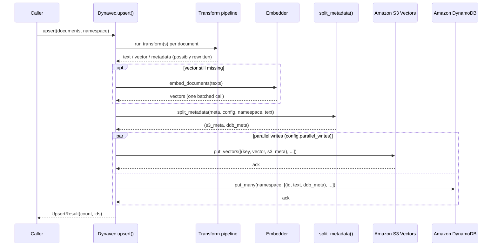
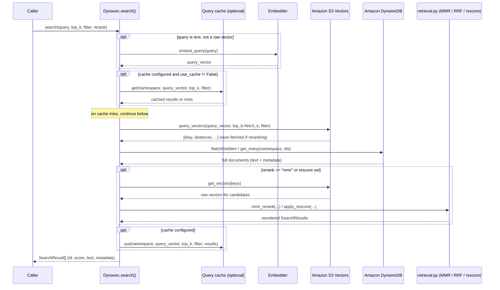
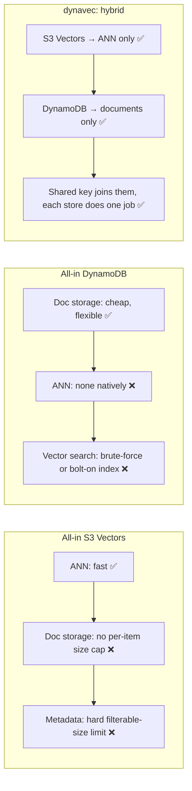

# dynavec architecture

## The core idea: two stores, one client

A vector search returns **ids fast**; hydrating the **actual documents** is what usually costs latency and money. dynavec splits those two jobs across the AWS primitive best suited to each:

| Concern | Store | Why |
|---------|-------|-----|
| Approximate nearest-neighbor over the embedding | **Amazon S3 Vectors** | AWS-managed ANN, serverless, scales to billions, 90%+ recall, storage priced like S3 (cheap). |
| Full document text + rich metadata, fetched by id | **Amazon DynamoDB** | Single-digit-ms `BatchGetItem`, no per-item size cap, on-demand billing, partition-key scaling. |

The vector's **key** is shared between the two stores (`"{namespace}#{id}"`), which is the join. S3 Vectors answers "which ids are nearest"; DynamoDB answers "give me those documents, now."

```
query text ──embed──▶ query_vectors (S3 Vectors) ──▶ [ (id, distance) × fetch_k ]
                                                           │
                                                           ▼
                                        BatchGetItem (DynamoDB)  ──▶ full docs
                                                           │
                                                           ▼
                                   MMR rerank / RRF fusion ──▶ SearchResults
```

## Sequence diagrams

### Upsert

`upsert()` runs a three-stage pipeline — **transform → embed → split & write** — before anything touches AWS. The two writes (S3 Vectors and DynamoDB) are independent per-chunk tasks, so they run **in parallel** when `DynavecConfig.parallel_writes` is enabled (the default).



Key point: **S3 Vectors only ever sees the small filterable slice of metadata** (`s3_meta`); DynamoDB gets the full text and untouched metadata (`ddb_meta`). The vector itself is written once, to S3 Vectors only — DynamoDB never stores raw vectors on the normal write path.

### Search

`search()` is a **fan-out-then-hydrate** pattern: S3 Vectors returns nearest IDs, DynamoDB turns those IDs into full documents, and any reranking that needs raw vectors (MMR, rescore) makes one extra `get_vectors` call to S3 Vectors.



The over-fetch (`top_k × config.over_fetch`) exists precisely because reranking needs a wider candidate pool than the final `top_k` — S3 Vectors gives you a cheap coarse ranking, then dynavec re-sorts a small candidate set with the more expensive MMR/RRF logic client-side.

## Why not put everything in one store?



- **All in S3 Vectors:** metadata has a per-vector filterable-size cap and it's not built to be your document-of-record; reading large text back through the vector API is wasteful.
- **All in DynamoDB:** DynamoDB has no native ANN; you'd brute-force or bolt on a secondary index and lose the serverless-ANN economics.
- **Hybrid:** each store does the one thing it's best at. That's the whole pitch.

## The metadata split

On upsert, `split_metadata()` produces two payloads:

- **S3 Vectors** gets a **small filterable subset** (`DynavecConfig.filterable_keys`, or all scalar keys by default) plus a namespace tag `_dv_ns`. These are the keys you can pre-filter on during ANN (`filter={"topic": "biology"}`), using the S3 Vectors MongoDB-style operators (`$eq`, `$gte`, `$in`, `$and`, `$or`, …).
- **DynamoDB** gets the **full, untouched metadata** + the source text. Numbers are stored natively (float→Decimal) so future Global Secondary Indexes can support DynamoDB-side access patterns.

Keep the filterable set small — it's the one thing with a hard size limit.

## Namespaces & partitioning

Every operation takes a `namespace`. It:
- tags each vector (`_dv_ns`) so **one index can host many tenants/collections** with query-time isolation, and
- prefixes the DynamoDB partition key (`"{namespace}#{id}"`) so load spreads evenly across partitions and hydration stays O(1) per document.

This is the "DynamoDB access-pattern + partitioning logic connected to the vector store" the design calls for.

## Retrieval algorithms dynavec owns

S3 Vectors owns the ANN. dynavec owns everything around it:

- **Score normalization** — raw distance → "higher = more similar" regardless of metric.
- **MMR reranking** (`rerank="mmr"`) — relevance + diversity. dynavec over-fetches `top_k × over_fetch` candidates, pulls their vectors via `get_vectors`, and re-ranks.
- **RRF hybrid fusion** (`reciprocal_rank_fusion`) — combine dense results with a sparse/keyword ranking (or several indexes) without score-scale alignment. This is the seam for hybrid search.

## Multi-dimension / multi-index routing

Different embedding models produce different dimensions. Because a `Dynavec` client is bound to one `(bucket, index, dimension)`, you run **one client per dimension/model** and route at the application layer (or fuse their results with RRF). Multiple S3 vector buckets → multiple dimensions, connected through the shared DynamoDB access patterns.

## Roadmap: the hot tier (v0.2)

This is where user-controlled ANN algorithms actually live. An optional in-process **`hnswlib`** index caches frequently-accessed partitions in memory for **sub-10-ms** queries, backed by DynamoDB for durability and S3 Vectors for the cold/scale tier. Reads check hot → warm → cold; writes fan out. SPFresh-style incremental rebalancing is the research direction for keeping the hot index fresh without full rebuilds.

Also planned: async client (`aioboto3`), sparse/BM25 hybrid computed from DynamoDB, cross-encoder reranking, and LlamaIndex / CrewAI / Strands adapters.

## Security & compliance

- **Data residency:** DynamoDB and S3 Vectors are regional. dynavec never sends your vectors or documents anywhere except those two services in *your* account and region. Embedding is the only step that may leave the account — and only if you choose a hosted embedder (OpenAI/Gemini/Cohere). Choose `BedrockEmbedder` or `SentenceTransformerEmbedder` to keep embedding in-account/offline.
- **IAM (least privilege):** the client needs, scoped to your specific resources:
  - `s3vectors:PutVectors`, `s3vectors:QueryVectors`, `s3vectors:GetVectors`, `s3vectors:DeleteVectors` (+ `CreateVectorBucket`/`CreateIndex` only if using `auto_provision`)
  - `dynamodb:BatchGetItem`, `dynamodb:BatchWriteItem`, `dynamodb:PutItem`, `dynamodb:DeleteItem` (+ `CreateTable`/`DescribeTable` for provisioning)
- **Encryption:** both services support encryption at rest with your KMS keys; enable SSE-KMS on the table and bucket.
