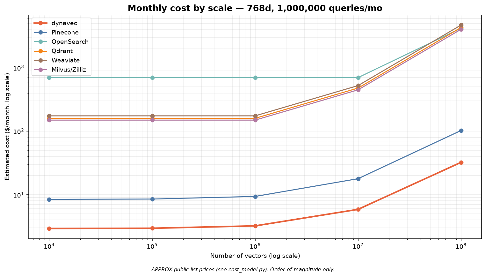
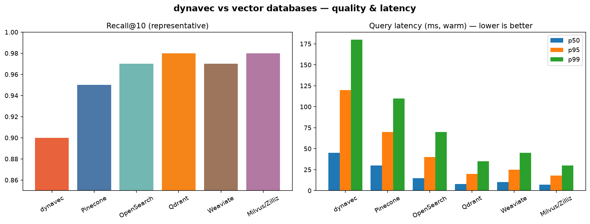
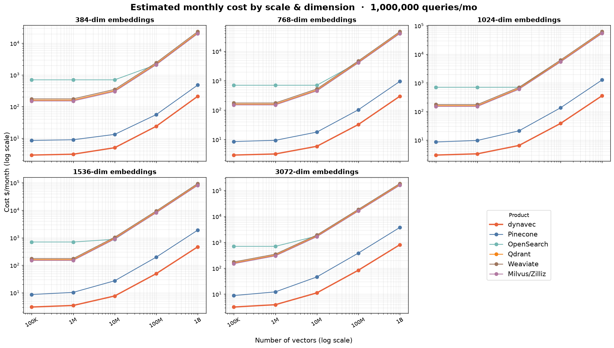
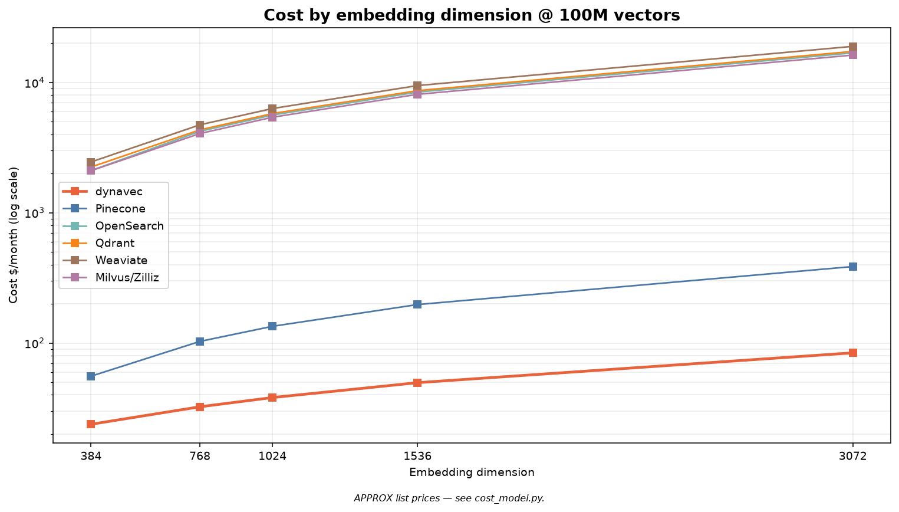
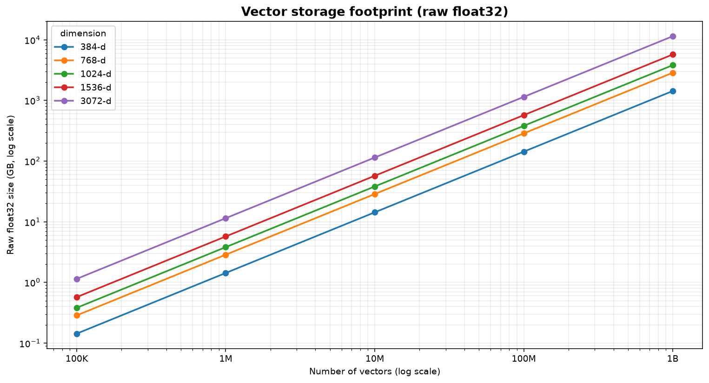

# dynavec

**Serverless, in-your-own-account hybrid vector database on AWS.**
`dynavec` fuses **Amazon DynamoDB** (single-digit-millisecond metadata + document store) with **Amazon S3 Vectors** (billion-scale, AWS-managed approximate-nearest-neighbor search) into one Python client — a drop-in alternative to Pinecone, Qdrant, Milvus, Weaviate, and OpenSearch that **runs entirely inside your AWS account** and **bills only when you use it**.

```bash
# with pip
pip install dynavec                            # base: boto3 + numpy only
pip install "dynavec[openai]"                  # + OpenAI embedder
pip install "dynavec[sentence-transformers]"   # + local/offline embedder
pip install "dynavec[all]"                     # every embedder + framework adapters

# with uv (installs from the same PyPI index)
uv add dynavec
uv add "dynavec[all]"
```

---

## Why dynavec

| Goal | How dynavec delivers it |
|------|-------------------------|
| **Cost-effective** | No always-on servers, no managed-service premium. You pay S3 Vectors storage/query + DynamoDB on-demand. Idle cost ≈ storage only. |
| **Lowest latency** | ANN keys come from S3 Vectors; the **actual documents are hydrated from DynamoDB via `BatchGetItem` in single-digit ms**. Warm S3 Vectors queries land ~100 ms. |
| **Scale** | S3 Vectors is designed to search across **billions of vectors** with 90%+ recall. |
| **Data compliance** | Every byte stays in **your** account, **your** region, **your** AZs. dynavec only ever calls AWS with your credentials. No third-party data plane. |
| **Secure / elastic** | Serverless primitives scale to zero and back automatically; IAM is the only access boundary. |

### What dynavec is *not* pretending to be

S3 Vectors **is** the ANN engine — AWS manages the index internally, so you don't (and can't) choose HNSW vs SPANN vs SPFresh there. dynavec's algorithmic value is the layers **around** it that you *do* control: the two-store hybrid design, metadata pre-filtering, **RRF hybrid fusion**, **MMR diversity reranking**, namespace/partition routing, and (on the roadmap) an optional in-process `hnswlib` **hot tier** for sub-10-ms hot-partition queries. See [ARCHITECTURE.md](ARCHITECTURE.md).

---

## Architecture at a glance

```
             ┌──────────────────────── your AWS account ────────────────────────┐
  upsert ───▶│  Embedder (BYO key: OpenAI / Gemini / Cohere / Bedrock / local)   │
             │        │                                                          │
             │        ▼                                                          │
             │  ┌─────────────┐   vector + small filterable metadata            │
             │  │ S3 Vectors  │◀──────────────────────────────────┐            │
             │  │ (ANN index) │                                    │            │
             │  └─────────────┘   full text + rich metadata        │            │
             │  ┌─────────────┐◀──────────────────────────────────┘            │
             │  │  DynamoDB   │                                                  │
             │  │ (documents) │                                                  │
             │  └─────────────┘                                                  │
             │                                                                   │
  search  ──▶│  1) query_vectors → keys+distance   2) BatchGetItem → documents   │
             │  3) MMR rerank / RRF hybrid fusion → ranked SearchResults         │
             └───────────────────────────────────────────────────────────────────┘
```

---

## Quick start

```python
from dynavec import Dynavec, DynavecConfig, Document
from dynavec.embeddings import OpenAIEmbedder   # or Gemini / Bedrock / SentenceTransformer

cfg = DynavecConfig(
    vector_bucket="my-vectors",     # S3 vector bucket
    index="docs",                   # vector index
    table="dynavec_docs",           # DynamoDB table
    dimension=1536,
    distance_metric="cosine",
    region="us-east-1",
    auto_provision=True,            # create bucket + index + table if missing
)

db = Dynavec(cfg, embedder=OpenAIEmbedder(model="text-embedding-3-small"))

db.upsert(
    [
        Document(id="a", text="The mitochondria is the powerhouse of the cell.",
                 metadata={"topic": "biology", "year": 2021}),
        Document(id="b", text="Rockets reach orbit at roughly 28,000 km/h.",
                 metadata={"topic": "space", "year": 2023}),
    ],
    auto_metadata=True,             # also attach hash/timestamp/word counts
)

hits = db.search(
    "how do cells make energy?",
    top_k=3,
    filter={"topic": "biology"},    # S3 Vectors metadata pre-filter
    rerank="mmr",                   # diversity-aware reranking
)
for h in hits:
    print(h.score, h.id, h.text)
```

### Bring your own vectors (no embedder needed)

```python
db = Dynavec(cfg)  # no embedder
db.upsert([Document(id="x", vector=my_1536_dim_vector, metadata={"lang": "en"})])
hits = db.search(vector=my_query_vector, top_k=5)
```

### The metadata switch

- **You provide metadata** → stored verbatim (full copy in DynamoDB, filterable subset in S3 Vectors).
- **`auto_metadata=True`** → dynavec also derives `created_at`, `content_hash`, `word_count`, `char_count`. Your keys always win on conflict.

Control the split with `DynavecConfig.filterable_keys` (allowlist of keys pushed to S3 Vectors for filtering) — keep it small; S3 Vectors caps filterable metadata size per vector.

---

## Framework integrations

### LangChain

```python
from dynavec.integrations.langchain import DynavecVectorStore

store = DynavecVectorStore(db, namespace="kb")
retriever = store.as_retriever(search_kwargs={"k": 4})
```

LlamaIndex, CrewAI, and Strands adapters are on the roadmap; the core client works in any of them today.

---

## Namespaces & multi-tenancy

Every write/read takes a `namespace`. dynavec tags each vector with its namespace and scopes queries to it automatically, so a single index can host many tenants (or many embedding "collections") with clean isolation. DynamoDB keys are `"{namespace}#{id}"` for even partition distribution.

---

## Provisioning & IAM

`auto_provision=True` (or `db.provision()`) creates the S3 vector bucket, the vector index, and the DynamoDB table idempotently. The caller needs `s3vectors:*` on the bucket/index and `dynamodb:*` on the table (scope these down in production — see [ARCHITECTURE.md](ARCHITECTURE.md)).

---

## Benchmarks

`benchmarks/` measures recall@k, latency (p50/p95/p99), and estimated \$/month, with a cost model comparing dynavec to Pinecone / Qdrant / Milvus / Weaviate / OpenSearch. See [benchmarks/README.md](benchmarks/README.md).

### Cost by scale

dynavec has **no idle floor** — you pay storage + per-request, so it stays far below cluster- and OCU-based systems, and tracks serverless Pinecone while keeping your data in-account.



### Quality & latency



### Comparison (1M × 768d, 1M queries/mo)

| Metric | dynavec | Pinecone | OpenSearch | Qdrant | Weaviate | Milvus/Zilliz |
|---|---|---|---|---|---|---|
| Recall@10 | 0.90 | 0.95 | 0.97 | **0.98** | 0.97 | 0.98 |
| Latency p50 (ms) | 45 | 30 | 15 | 8 | 10 | **7** |
| Latency p95 (ms) | 120 | 70 | 40 | 20 | 25 | **18** |
| Cost ($/mo) | **$3** | $9 | $701 | $160 | $175 | $150 |
| Serverless (scale-to-zero) | Yes | Yes | No (OCU floor) | No (nodes) | No (nodes) | No (CU) |
| Data in your AWS account | Yes | No | Yes | Self-host only | Self-host only | Self-host only |

> **Honesty note:** the **cost** row is computed by the repo's cost model from public list prices (order-of-magnitude; verify before quoting). **Recall/latency** are representative figures pending a live AWS run — regenerate real numbers with the commands below.

### Scaling: every embedding dimension, 100K → 1 billion vectors

Cost across the common embedding dimensions (384 / 768 / 1024 / 1536 / 3072) and the full scale ladder. dynavec stays lowest at **every** point because its storage is priced like S3, not RAM — while cluster/OCU systems grow linearly with data held in memory.



| | Cost by dimension @ 100M vectors | Raw storage footprint |
|---|---|---|
| |  |  |

**1536-dim (e.g. OpenAI `text-embedding-3-small`) — $/month @ 1M queries/mo:**

| Product | 100K | 1M | 10M | 100M | 1B |
|---|---|---|---|---|---|
| **dynavec** | **$3** | **$3** | **$8** | **$50** | **$469** |
| Pinecone | $9 | $10 | $27 | $197 | $1,897 |
| OpenSearch | $701 | $701 | $877 | $8,423 | $83,708 |
| Qdrant | $160 | $160 | $960 | $8,640 | $85,920 |
| Weaviate | $175 | $175 | $1,050 | $9,450 | $93,975 |
| Milvus/Zilliz | $150 | $150 | $900 | $8,100 | $80,550 |
| _raw float32 size_ | 1 GB | 6 GB | 57 GB | 572 GB | 5,722 GB |

Full tables for all five dimensions: [docs/assets/scaling.md](docs/assets/scaling.md). At 1B × 1536-d that's ~5.7 TB of raw vectors — where dynavec's product quantization and the S3-priced tier matter most.

```bash
pip install "dynavec[benchmark]"          # or: uv add "dynavec[benchmark]"

# reproduce the charts + table above
python -m benchmarks.report --vectors 1_000_000 --dim 768 --qpm 1_000_000

# measure real recall + latency against your own AWS account
python -m benchmarks.run_benchmark --backend dynavec \
    --bucket my-vectors --index bench --table dynavec_bench --n 100000 --dim 768
```

---

## Capabilities

| Area | What you get | API |
|------|--------------|-----|
| **Distance metrics** | Index on cosine/euclidean (S3 Vectors native); client-side rescore in cosine / dot / euclidean / manhattan or a **weighted combination** | `search(..., rescore={"cosine":0.7,"manhattan":0.3})` |
| **Concurrency** | GIL-aware thread pool — real parallelism for I/O-bound AWS calls; parallel batched writes + `search_many` | `DynavecConfig(max_workers=8)`, `db.search_many([...])` |
| **Streaming** | Results yielded page-by-page as S3 Vectors paginates, so agents start consuming early | `for hit in db.search_stream(q): ...` |
| **Namespace RAG** | Per-tenant/collection handles; isolation + even partitioning | `kb = db.namespace("kb"); kb.search(...)` |
| **Product quantization** | Compress cached/hot-tier vectors up to 32× (ADC distance) | `ProductQuantizer(m=96).fit(X)` |
| **Knowledge graph / ER** | Entities + relations in DynamoDB linked to embeddings; traverse to scope/guide vector search (GraphRAG) | `db.graph_add_edge(...)`, `db.graph_search(q, seed_entities=[...])` |
| **Query cache** | DynamoDB-TTL exact cache, in-process **semantic** cache (serves near-duplicate queries), or Redis/**ElastiCache** | `Dynavec(..., cache=SemanticCache())` |
| **Ingestion / MCP** | Pull + chunk + embed from any source; **any MCP server's resources** (Notion, Confluence, Drive, …) become a corpus | `ingest(db, MCPResourceSource(session))` |
| **Updates + Lambda** | Update text/vector/metadata (merge or replace); transform pipeline incl. **in-account AWS Lambda** | `db.update(id, ...)`, `Dynavec(..., transform=LambdaTransform(...))` |
| **IAM / credentials** | Access keys, session tokens, named profiles, cross-account **assume-role** | `Dynavec(..., credentials=AWSCredentials(...))` |
| **Frameworks** | LangChain + LlamaIndex vector stores; a framework-agnostic tool for LangGraph/CrewAI/Strands | `dynavec.integrations.*` |
| **Benchmark report** | Comparison table + recall/latency + cost-by-scale (log) charts | `python -m benchmarks.report` |

## Status

**v0.2** — everything in the table above, on top of the v0.1 hybrid core (pluggable embedders, RRF, MMR, provisioning). 61 tests. **Roadmap (v0.3):** native asyncio client (`aioboto3`), in-process `hnswlib` hot tier, sparse/BM25 hybrid computed from DynamoDB, sort-key graph adjacency for very high fan-out, and turnkey file parsers (PDF/DOCX/PPTX/XLSX) as ingestion sources.

## Publishing (maintainers)

`dynavec` publishes to **PyPI**; both `pip` and `uv` install from there (there is no separate "uv registry").

**Automated (recommended)** — a GitHub Release triggers [`.github/workflows/publish.yml`](.github/workflows/publish.yml), which builds and uploads via **PyPI Trusted Publishing (OIDC)** — no API token stored anywhere. One-time setup: on PyPI, add a *pending publisher* for project `dynavec`, repo `codeforstartups/dynavec`, workflow `publish.yml`, environment `pypi`. Then:

```bash
git tag v0.2.0 && git push origin v0.2.0     # then publish a GitHub Release for the tag
```

**Manual** — if you'd rather push from your machine with a token:

```bash
uv build                                      # -> dist/*.whl, dist/*.tar.gz
uv publish                                    # uses UV_PUBLISH_TOKEN / prompts
# or: python -m twine upload dist/*
```

Bump the version in **both** `pyproject.toml` and `src/dynavec/__init__.py` before releasing.

## License

Apache-2.0
